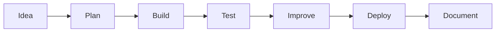

<!-- GitHub Profile README -->

<p align="center">
  
</p>

<h1 align="center">Hi 👋, I'm Shubham Utekar</h1>

<h3 align="center">
  Developer focused on AI, Machine Learning, Data Science and Web Applications
</h3>

<p align="center">
  
</p>

<p align="center">
  <a href="mailto:shubhamutekar09q@gmail.com">
    
  </a>
  <a href="https://github.com/Shubham-Ut">
    
  </a>
  <a href="#">
    
  </a>
  <a href="#">
    
  </a>
</p>

---

<p align="center">
  
</p>

<p align="center">
  
</p>

---

## 👨‍💻 About Me

```yaml
name: Shubham Utekar
role: Computer Science Engineering Student
focus: AI, Machine Learning, Data Science, Full Stack Development
currently_learning: Deep Learning, RAG Applications, Streamlit, Deployment
building: AI apps, ML models, dashboards and web applications
```

I like building clean and useful projects that combine **data, logic, design and automation**.  
My current focus is on creating practical applications using **Python, Machine Learning, Streamlit, Flask and modern web technologies**.

---

## 🧠 Developer Focus

<p align="center">
  
  
  
  
  
  
</p>

---

## 🛠️ Tech Stack

<p align="center">
  
</p>

<p align="center">
  
  
  
  
  
  
  
</p>

---

## 🚀 Featured Projects

<p align="center">
  <a href="#">
    
  </a>
  <a href="#">
    
  </a>
</p>

<p align="center">
  <a href="#">
    
  </a>
  <a href="#">
    
  </a>
</p>

---

## 📌 Project Areas

<table align="center">
<tr>
<td align="center" width="220">

<br><br>
<b>AI Applications</b>
<br>
<sub>AI-based tools and smart apps</sub>
</td>

<td align="center" width="220">

<br><br>
<b>ML Models</b>
<br>
<sub>Prediction and classification systems</sub>
</td>

<td align="center" width="220">

<br><br>
<b>Data Dashboards</b>
<br>
<sub>Visual insights and analytics</sub>
</td>

<td align="center" width="220">

<br><br>
<b>Web Apps</b>
<br>
<sub>Frontend, backend and database apps</sub>
</td>
</tr>
</table>

---

## 🧩 Workflow



---

## 📊 GitHub Analytics

<p align="center">
  
  
</p>

<p align="center">
  
</p>

<p align="center">
  
</p>

---

## 🌐 Profile Summary

<p align="center">
  
</p>

<p align="center">
  
  
  
</p>

---

## 🌱 Currently Improving

<p align="center">
  
  
  
  
  
</p>

---

## 📫 Connect With Me

<p align="center">
  <a href="mailto:shubhamutekar09q@gmail.com">
    
  </a>
  <a href="#">
    
  </a>
  <a href="https://github.com/Shubham-Ut">
    
  </a>
</p>

---

<p align="center">
  
</p>

<p align="center">
  <b>Learning • Building • Improving</b>
</p>

<p align="center">
  
</p>

<p align="center">
  
</p>
