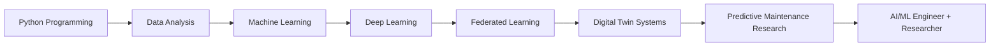
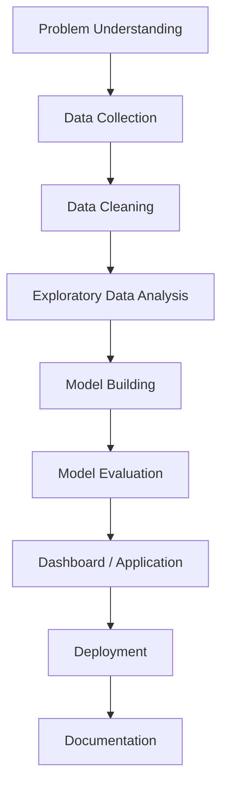

<!-- PROFESSIONAL GITHUB PROFILE README -->

<p align="center">
  
</p>

<h1 align="center">Hi 👋, I'm Shubham Utekar</h1>

<h3 align="center">
  AI/ML Enthusiast • Data Science Researcher • Full Stack Developer
</h3>

<p align="center">
  
</p>

<p align="center">
  <a href="mailto:shubhamutekar09q@gmail.com">
    
  </a>
  <a href="https://github.com/Shubham-Ut">
    
  </a>
  <a href="https://www.linkedin.com/in/shubhamutekar?utm_source=share_via&utm_content=profile&utm_medium=member_android">
    
  </a>
</p>

---


## 🚀 About Me

I am a **B.Tech Computer Science Engineering student** passionate about building intelligent and practical technology solutions using **Artificial Intelligence, Machine Learning, Data Science, Full Stack Development, and IoT**.

My main research interest is in **Federated Digital Twin-Based Predictive Maintenance for Smart Manufacturing**, where I focus on combining **Digital Twins, Federated Learning, Machine Learning, Deep Learning, and Industrial IoT** to predict machine failures before breakdown.

- 🔬 Currently working on **Federated Digital Twin Predictive Maintenance**
- 🤖 Interested in **AI, ML, Data Science, Deep Learning, and Research**
- 🏭 Exploring **Industry 4.0, Smart Manufacturing, and Digital Twins**
- 📊 Building projects using **Python, Flask, Streamlit, Scikit-Learn, TensorFlow, and MySQL**
- 🌱 Currently learning **Advanced ML, Federated Learning, MLOps, and RAG pipelines**
- 🎯 Goal: To become an **AI/ML Engineer and Researcher**
- 📫 Reach me at **shubhamutekar09q@gmail.com**

<br clear="right"/>

---

## 🧠 Professional Profile

```text
Computer Science Engineering student with strong interest in Artificial Intelligence,
Machine Learning, Data Science, and Research. Skilled in Python, Machine Learning,
Data Analysis, Flask, Streamlit, SQL, and IoT-based systems.

Currently focused on research in Federated Learning, Digital Twins, and Predictive
Maintenance for Smart Manufacturing. Passionate about building real-world,
data-driven, and intelligent software solutions.
```

---

## 🔬 Current Research Focus

<p align="center">
  
  
  
</p>

### Federated Digital Twin-Based Predictive Maintenance

This research focuses on developing a privacy-preserving predictive maintenance system for smart manufacturing environments.

The system uses sensor data from industrial machines such as:

- Vibration
- Temperature
- Pressure
- Speed
- Torque
- Current consumption
- Tool wear

The aim is to predict possible machine failure before breakdown and reduce downtime, maintenance cost, and operational risk.

### Expected Research Output

| Area | Output |
|---|---|
| Machine Monitoring | Real-time machine health status |
| RUL Prediction | Remaining Useful Life estimation |
| Failure Prediction | Failure probability score |
| Maintenance Support | Early maintenance alerts |
| Privacy | Federated learning without sharing raw data |
| Visualization | Sensor trends and health dashboards |

---

## 🛠️ Tech Stack

### 👨‍💻 Programming Languages

<p align="center">
  
</p>

### 🤖 AI, ML & Data Science

<p align="center">
  
  <br><br>
  
  
  
  
  
  
</p>

### 🌐 Web Development

<p align="center">
  
  <br><br>
  
  
</p>

### 🗄️ Databases & Tools

<p align="center">
  
  <br><br>
  
  
  
</p>

---

## 🚀 Featured Projects

<table>
<tr>
<td width="50%">

### 🔬 Federated Digital Twin Predictive Maintenance

A research-based system for predicting machine failure using Digital Twins, Federated Learning, and Machine Learning.

**Tech Used:** Python, ML, TensorFlow, XGBoost, Federated Learning, Streamlit

</td>
<td width="50%">

### 📊 AI Autonomous Data Science Company

A multi-agent AI system that automates data cleaning, analysis, visualization, model training, and report generation.

**Tech Used:** Python, Streamlit, Pandas, Scikit-Learn, LLM APIs

</td>
</tr>

<tr>
<td width="50%">

### 🛒 Grocery Store Management System

A full-stack web application for inventory, product, employee, and order management.

**Tech Used:** Flask, MySQL, HTML, CSS, JavaScript

</td>
<td width="50%">

### 🔍 RAG Pipeline Project

A Retrieval-Augmented Generation system for intelligent document search and question answering.

**Tech Used:** Python, Vector Database, Embeddings, LLM, LangChain

</td>
</tr>

<tr>
<td width="50%">

### 🌊 Smart Water Level Monitoring System

An IoT-based system using ESP32 and ultrasonic sensors for real-time water level detection and alerts.

**Tech Used:** ESP32, MicroPython, Sensors, IoT

</td>
<td width="50%">

### 📈 Machine Learning Projects

Collection of ML projects covering regression, classification, clustering, prediction, and analytics.

**Tech Used:** Python, Pandas, NumPy, Scikit-Learn, Matplotlib

</td>
</tr>
</table>

---

## 📊 GitHub Analytics

<p align="center">
  
  
</p>

<p align="center">
  
</p>

<p align="center">
  
</p>

---

## 🏆 GitHub Trophies

<p align="center">
  
</p>

---

## 📚 Research Interests

<p align="center">
  
  
  
  
  
  
  
  
  
  
</p>

---

## 📌 Learning Roadmap



---

## 📈 My Development Workflow



---

## 🎯 Goals for 2026

- ✅ Build strong AI/ML and Data Science projects
- ✅ Publish research work in Predictive Maintenance and Digital Twins
- ✅ Improve GitHub project documentation
- ✅ Learn MLOps and model deployment
- ✅ Build real-world AI applications
- ✅ Contribute to open-source projects
- ✅ Create a professional AI/ML portfolio

---

## 🤝 Connect With Me

<p align="center">
  <a href="mailto:shubhamutekar09q@gmail.com">
    
  </a>
  <a href="#">
    
  </a>
  <a href="https://github.com/Shubham-Ut">
    
  </a>
  <a href="#">
    
  </a>
</p>

---

## 💡 Quote

<p align="center">
  <b>"Building intelligent systems that transform data into real-world impact."</b>
</p>

---

<p align="center">
  
</p>

<p align="center">
  
</p>
