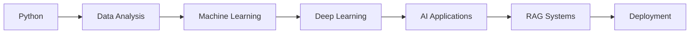
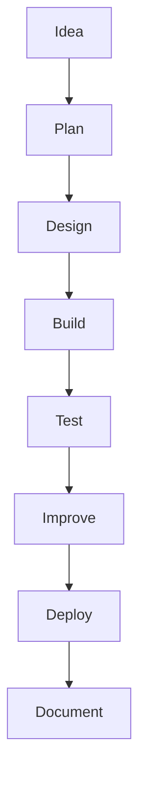

<!-- GitHub Profile README -->

<p align="center">
  
</p>

<h1 align="center">Hi 👋, I'm Shubham Utekar</h1>

<h3 align="center">
  AI & Machine Learning Enthusiast | Data Science Learner | Full Stack Developer
</h3>

<p align="center">
  
</p>

<p align="center">
  <a href="mailto:shubhamutekar09q@gmail.com">
    
  </a>
  <a href="https://github.com/Shubham-Ut">
    
  </a>
  <a href="#">
    
  </a>
  <a href="#">
    
  </a>
</p>

---

<p align="center">
  
</p>

## 👨‍💻 About Me

```yaml
name: Shubham Utekar
education: B.Tech Computer Science Engineering
focus: AI, Machine Learning, Data Science, Full Stack Development
currently_learning: Deep Learning, RAG Applications, Streamlit, Model Deployment
building: AI apps, ML models, dashboards, and web applications
goal: To build useful technology solutions with clean design and strong functionality
```

I enjoy creating projects that combine **data, logic, design, and automation**.  
My main focus is on building practical applications using **Python, Machine Learning, Streamlit, Flask, and modern web technologies**.

---

## ✨ What I Like Building

<p align="center">
  
  
  
  
  
  
</p>

---

## 🛠️ Tech Stack

<p align="center">
  
</p>

<p align="center">
  
  
  
  
  
  
  
</p>

---

## 🚀 Featured Projects

<p align="center">
  <a href="#">
    
  </a>
  <a href="#">
    
  </a>
</p>

<p align="center">
  <a href="#">
    
  </a>
  <a href="#">
    
  </a>
</p>

---

## 📌 Project Focus

<table align="center">
<tr>
<td align="center" width="220">

<br><br>
<b>AI Apps</b>
<br>
<sub>Smart apps using AI and automation</sub>
</td>

<td align="center" width="220">

<br><br>
<b>ML Models</b>
<br>
<sub>Prediction, classification and analysis</sub>
</td>

<td align="center" width="220">

<br><br>
<b>Dashboards</b>
<br>
<sub>Clean data visualization and insights</sub>
</td>

<td align="center" width="220">

<br><br>
<b>Web Apps</b>
<br>
<sub>Frontend, backend and database projects</sub>
</td>
</tr>
</table>

---

## 📊 GitHub Stats

<p align="center">
  
  
</p>

<p align="center">
  
</p>

<p align="center">
  
</p>

---

## 🌱 Current Learning Path



---

## ⚙️ Development Flow



---

## 🎯 Current Goals

- Build clean and useful AI-powered projects  
- Improve machine learning and data science skills  
- Create interactive dashboards and Streamlit apps  
- Learn RAG pipelines and LLM-based applications  
- Improve project structure, UI, and documentation  
- Deploy projects and maintain a strong GitHub portfolio  

---

## 📫 Connect With Me

<p align="center">
  <a href="mailto:shubhamutekar09q@gmail.com">
    
  </a>
  <a href="#">
    
  </a>
  <a href="https://github.com/Shubham-Ut">
    
  </a>
</p>

---

<p align="center">
  
</p>

<p align="center">
  
</p>

<p align="center">
  <b>Learning • Building • Improving</b>
</p>

<p align="center">
  
</p>
