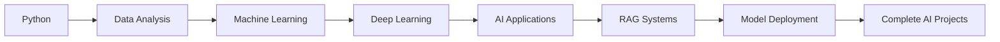
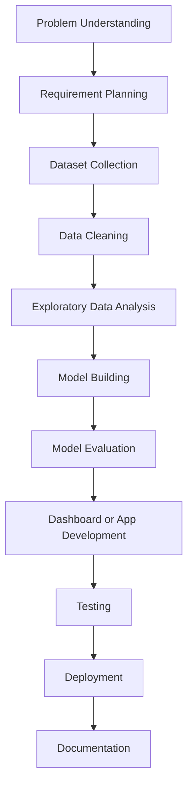

  

<h1 align="center">Hi 👋, I'm Shubham Utekar</h1>

<h3 align="center">
  AI & Machine Learning Enthusiast | Data Science Learner | Full Stack Developer
</h3>

  

  
  
  
  

---

## 👨‍💻 About Me

I am a **B.Tech Computer Science Engineering student** with a strong interest in **Artificial Intelligence, Machine Learning, Data Science, Full Stack Development, and AI-powered applications**.

I enjoy building practical projects where data, software, and automation work together to solve real-world problems. My current focus is on developing projects related to **machine learning, predictive analytics, data dashboards, document intelligence, RAG pipelines, and AI-based automation systems**.

- 🎓 B.Tech Computer Science Engineering Student  
- 🧠 Learning **AI, Machine Learning, Deep Learning, and Data Science**
- 💻 Building projects using **Python, Streamlit, Flask, MySQL, HTML, CSS, and JavaScript**
- 📊 Interested in **Data Analysis, Predictive Modeling, Dashboards, and Automation**
- 🔍 Exploring **RAG Pipelines, LLM Applications, and AI Tools**
- 🚀 Focused on creating clean, useful, and real-world project solutions
- 📫 Reach me at **shubhamutekar09q@gmail.com**

---

## 🧩 What I Work On

<table>
<tr>
<td width="50%">

### 🤖 Artificial Intelligence

I build AI-based applications that help automate tasks, analyze data, and generate useful outputs from user input.

</td>
<td width="50%">

### 📊 Data Science

I work with datasets, perform data cleaning, analyze patterns, create visualizations, and build dashboards.

</td>
</tr>

<tr>
<td width="50%">

### 🧠 Machine Learning

I create ML models for prediction, classification, regression, and performance comparison.

</td>
<td width="50%">

### 🌐 Full Stack Development

I build web-based applications using frontend, backend, databases, and interactive user interfaces.

</td>
</tr>

<tr>
<td width="50%">

### 🔍 RAG & LLM Applications

I am learning to build applications that combine documents, embeddings, vector databases, and language models.

</td>
<td width="50%">

### ⚙️ Automation

I like creating systems that reduce manual work through smart workflows, dashboards, and AI tools.

</td>
</tr>
</table>

---

## 🛠️ Tech Stack

### 👨‍💻 Programming Languages

  

### 🤖 AI, ML & Data Science

  
  
  
  
  
  
  
  

### 🌐 Web & App Development

  
    
  
  
  

### 🗄️ Databases & Tools

  
    
  
  
  
  

---

## 🚀 Current Projects

<table>
<tr>
<td width="50%">

## 🤖 AI Autonomous Data Science App

An AI-powered data science application that allows users to upload datasets and automatically perform important data science steps.

### Features

- Upload CSV or Excel dataset
- Display dataset preview
- Detect missing values
- Clean and preprocess data
- Generate basic data insights
- Create charts and visualizations
- Select target column
- Train machine learning models
- Show model accuracy and performance
- Generate simple analysis report

### Tech Used

`Python` `Streamlit` `Pandas` `NumPy` `Scikit-Learn` `Plotly` `Matplotlib`

</td>
<td width="50%">

## 🔍 RAG Pipeline Application

A document-based question-answering system where users can upload documents and ask questions from the content.

### Features

- Upload PDF or text documents
- Split documents into smaller chunks
- Convert text into embeddings
- Store embeddings in vector database
- Retrieve relevant document sections
- Generate answers using LLM
- Useful for notes, reports, PDFs, and study material

### Tech Used

`Python` `LangChain` `Vector Database` `Embeddings` `LLM` `Streamlit`

</td>
</tr>

<tr>
<td width="50%">

## 📊 Machine Learning Projects Collection

A collection of machine learning projects focused on learning and applying ML concepts using real datasets.

### Includes

- Regression models
- Classification models
- Data preprocessing
- Feature selection
- Model training
- Model testing
- Accuracy comparison
- Data visualization
- Model evaluation reports

### Algorithms Used

`Linear Regression` `Logistic Regression` `Decision Tree` `Random Forest` `KNN` `SVM` `XGBoost`

### Tech Used

`Python` `Pandas` `NumPy` `Scikit-Learn` `Matplotlib`

</td>
<td width="50%">

## 🏭 Predictive Maintenance System

A machine learning-based system that predicts possible machine failure using sensor data.

### Features

- Machine sensor data analysis
- Failure prediction
- Remaining Useful Life estimation
- Health score calculation
- Maintenance alert generation
- Sensor trend visualization
- Model performance comparison

### Data Used

Machine sensor data such as:

- Temperature
- Vibration
- Pressure
- Speed
- Current
- Tool wear

### Tech Used

`Python` `Pandas` `Scikit-Learn` `XGBoost` `TensorFlow` `Streamlit`

</td>
</tr>

<tr>
<td width="50%">

## 📈 Data Analytics Dashboard

An interactive dashboard for analyzing datasets and displaying useful insights in a simple visual format.

### Features

- Dataset summary
- Column-wise analysis
- Missing value report
- Numerical charts
- Categorical charts
- Correlation analysis
- Filter-based insights
- Downloadable report

### Charts Included

- Bar chart
- Line chart
- Histogram
- Pie chart
- Correlation heatmap
- Scatter plot

### Tech Used

`Python` `Streamlit` `Pandas` `Plotly` `Matplotlib`

</td>
<td width="50%">

## 🧠 Deep Learning Practice Projects

A set of beginner-to-intermediate deep learning projects for understanding neural networks and model training.

### Includes

- Artificial Neural Network basics
- Model training and testing
- Activation functions
- Loss functions
- Optimizers
- Accuracy and loss graphs
- Prediction examples

### Concepts Covered

- ANN
- Dense layers
- Epochs
- Batch size
- Model evaluation
- Overfitting and underfitting

### Tech Used

`Python` `TensorFlow` `Keras` `NumPy` `Matplotlib`

</td>
</tr>

<tr>
<td width="50%">

## 📄 AI Resume Analyzer

An AI-based application that analyzes resumes and gives improvement suggestions.

### Features

- Upload resume
- Extract text from resume
- Identify skills
- Match skills with job role
- Suggest missing skills
- Give resume improvement tips
- Generate simple score

### Use Case

Helpful for students and job seekers to improve their resumes before applying for internships or jobs.

### Tech Used

`Python` `NLP` `Streamlit` `PDF Processing` `Machine Learning`

</td>
<td width="50%">

## 🧾 Smart Document Summarizer

A document summarization application that creates short and meaningful summaries from long documents.

### Features

- Upload document
- Extract important content
- Generate short summary
- Highlight key points
- Create easy-to-read output
- Useful for study notes and reports

### Use Case

Helpful for quickly understanding long PDFs, notes, and project documents.

### Tech Used

`Python` `NLP` `LLM` `Streamlit` `Text Processing`

</td>
</tr>
</table>

---

## 📌 Main Areas of Interest

  
  
  
  
  
  
  
  
  
  

---

## 🧠 Skills Overview

<table>
<tr>
<td width="33%">

### Programming

- Python
- Java
- JavaScript
- SQL
- HTML
- CSS

</td>
<td width="33%">

### Data & ML

- Data Cleaning
- Data Analysis
- Visualization
- ML Models
- Model Evaluation
- Prediction Systems

</td>
<td width="33%">

### Development

- Streamlit Apps
- Flask Apps
- Dashboards
- REST APIs
- Database Integration
- GitHub Documentation

</td>
</tr>
</table>

---

## 📊 GitHub Analytics

  
  

  

  

---

## 🏆 GitHub Trophies

  

---

## 🧭 Learning Path

---

## ⚙️ Project Development Workflow

---

## 🎯 Current Goals

- Build complete AI and machine learning projects  
- Create useful data science applications  
- Improve skills in Python, ML, and full stack development  
- Learn RAG pipelines and LLM-based applications  
- Build dashboards with clean UI and useful insights  
- Learn model deployment and project documentation  
- Improve GitHub repositories with proper README files  

---

## 📫 Connect With Me

  
  
  
 

---

  <b>"Learning, building, and improving one project at a time."</b>

---

  

  

